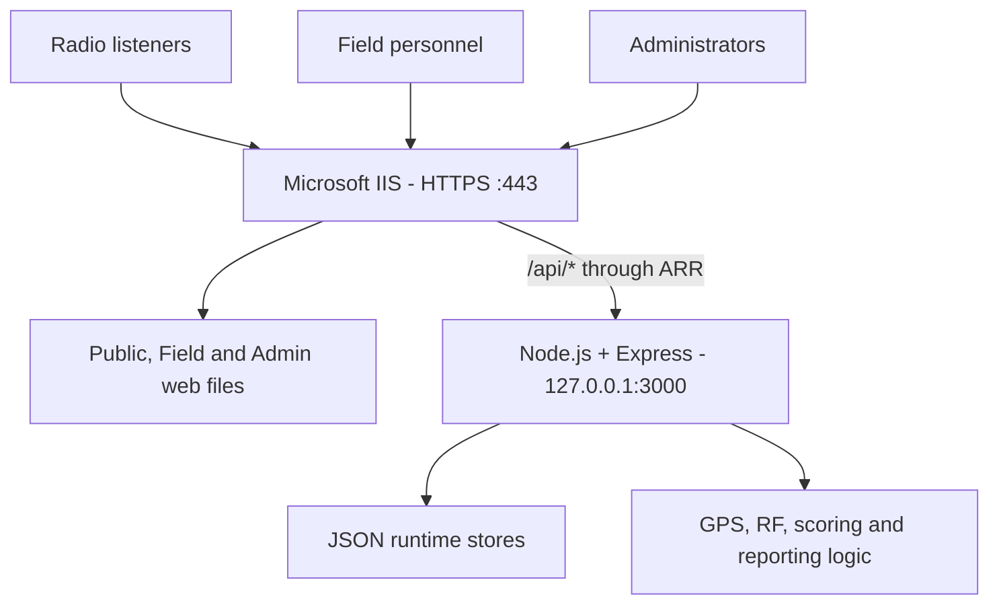

# MBI Broadcast Signal Logger


A browser-based platform for collecting, managing and analysing broadcast signal reports from radio listeners, field personnel and administrators.

## Project context

Developed during my IT internship at Murphy Ben International (MBI) as an internship/internal experimental project for collecting and analyzing broadcast signal reports. I was responsible for the design and implementation of the application, working under the guidance of a senior member of the IT team.

This repository is a portfolio representation of the project. Sensitive configuration, internal information, production data, credentials, and company-specific deployment details have been excluded.

## What the project is about

MBI Broadcast Signal Logger turns reception observations into structured data that can be reviewed and analysed. It brings three reporting and management workflows into one system:

| Application | Route | Purpose |
|---|---|---|
| Public / Volunteer Logger | `/` | Allows radio listeners and fans to report reception quality from their location |
| Field Engineer Logger | `/field/` | Captures GPS position, field observations and optional technical readings |
| Admin Control Center | `/admin/` | Manages reports, stations, channels, maps, analytics, configuration and exports |

The Public page is served at the root route (`/`) in the current implementation; it is the project's Public interface rather than a separate `/public/` route.

The backend validates submissions, creates incident IDs, stores Public and Field reports separately, calculates analytical RF references and exposes data through a REST API.

## Why I built it

Broadcast teams need reliable information about how a radio signal is received across different locations. Sending personnel to every location can be slow and resource-intensive, while feedback received through calls or messages is difficult to compare and analyse.

I built this project to:

- make it easier to collect analytical data about radio-signal reception;
- receive structured reports directly from radio listeners and fans;
- reduce the need to send field personnel for every initial signal check;
- capture location, time, station and reception conditions consistently;
- support quick, one-handed report submission on a mobile device;
- combine Public and Field observations for easier analysis and follow-up.

## How I built it

1. I separated the user experience into Public, Field and Admin interfaces.
2. I built the browser interfaces with HTML5, CSS3 and vanilla JavaScript.
3. I created a Node.js and Express REST API for validation, storage and calculations.
4. I used separate JSON stores for Field incidents, Public incidents, configuration, audit records and ID sequences.
5. I added GPS capture, Haversine distance, nominal EIRP and RF reference calculations.
6. I added observation scoring for signal quality, stability and service condition.
7. I implemented server-generated incident IDs and duplicate-submission protection.
8. I added Admin maps, filtering, CSV reporting, print output and KML export.
9. I used Microsoft IIS to serve the frontend and URL Rewrite with ARR to proxy `/api/*` to Node.js.
10. I used HTTPS for the public-facing IIS site while keeping Node.js bound to the local loopback interface.

## System architecture



### Request flow

```text
Browser
  -> HTTPS request to IIS on port 443
  -> IIS serves the Public, Field, Admin and shared frontend files
  -> /api/* requests are matched by URL Rewrite
  -> ARR forwards API requests to 127.0.0.1:3000
  -> Express validates and processes each request
  -> JSON runtime stores are read or updated
  -> The response returns through IIS to the browser
```

## Main features

- GPS-first incident capture with accuracy reporting
- Separate Public and Field reporting workflows
- Server-generated `INC` and `PUB` incident IDs
- Duplicate-submission protection
- Configurable stations, channels, forms and observation choices
- Signal quality, stability and service-condition scoring
- Haversine distance calculation
- RF power normalization and nominal EIRP
- Terrestrial horizon-limited reception-radius reference
- Field and combined Admin maps
- Incident filtering, status updates and history
- CSV, print and Google Earth KML reports
- Dark mode and responsive navigation
- Field service worker and offline queue
- Audit records and runtime health checks

## How to use each page

### Public / Volunteer Logger — `/`

This page is designed for listeners and radio fans submitting a quick reception report.

1. Open the Public page on a phone or computer.
2. Read and dismiss the introductory window when it appears.
3. Allow location access so the report can include the current GPS position.
4. Enter a name if the optional reporter-name field is enabled.
5. Select the station.
6. Select the channel or frequency when applicable.
7. Choose the observed **Signal Quality**.
8. Choose the observed **Signal Stability**.
9. Choose the **Service Condition**.
10. Add a short comment or observation if necessary.
11. Review the report summary and submit it.

The server validates the required fields, generates a `PUB` incident ID and stores the report in the Public incident stream.

### Field Engineer Logger — `/field/`

This page supports more detailed checks by field personnel.

1. Open the Field page and start a new report.
2. Enter or confirm the engineer/operator name.
3. Capture the current GPS position and check the reported accuracy.
4. Select the station and channel being assessed.
5. Record signal quality, stability and service condition.
6. Enter any available technical reading or custom field.
7. Add an observation describing the reception problem or test result.
8. Select the priority and assignment information where configured.
9. Review the captured information and submit the incident.
10. Use recent history, maps or offline controls when those features are enabled.

The server generates an `INC` incident ID, adds the available distance and RF reference information, and stores the report in the Field incident stream.

### Admin Control Center — `/admin/`

This page provides the operational and analytical view of the system.

- **Dashboard:** review report totals, trends, categories and recent incidents.
- **Incidents:** search, filter and inspect Public and Field reports.
- **Status and assignment:** update the progress, priority and ownership of incidents.
- **Stations and channels:** maintain the options available to reporting pages.
- **Maps:** compare incident locations with configured station locations.
- **Exports:** produce filtered CSV, printable and Google Earth KML reports.
- **Public configuration:** control Public fields, content, choices and presentation.
- **Field configuration:** control Field sections, custom fields, choices and workflow.
- **Users and permissions:** maintain administrative roles and access settings.
- **System health and audit:** review storage checks, activity and configuration events.

Administrator access must be protected in a real deployment. No production credentials are provided in this repository.

## Run locally

### Requirements

- Node.js 18 or newer
- npm

### Setup

From the repository root:

```bash
cp server/config.example.json server/config.json
cd server
npm ci
npm start
```

On Windows PowerShell:

```powershell
Copy-Item server/config.example.json server/config.json
Set-Location server
npm ci
npm start
```

Open:

| Application | Local URL |
|---|---|
| Public Logger | `http://localhost:3000/` |
| Field Logger | `http://localhost:3000/field/` |
| Admin Control Center | `http://localhost:3000/admin/` |
| API health check | `http://localhost:3000/api/health` |

## Deploy with Microsoft IIS

The following process uses `https://signal-logger.example.com` as a placeholder. Replace it with a hostname you control and do not commit private deployment values.

### Prerequisites

- Windows Server with Microsoft IIS
- An HTTPS certificate for the selected hostname
- IIS URL Rewrite
- IIS Application Request Routing (ARR)
- Node.js 18 or newer
- A method for running Node.js as a persistent Windows service
- DNS pointing the selected hostname to the server

### 1. Prepare the application

1. Copy the project to an application directory.
2. Copy `server/config.example.json` to `server/config.json`.
3. Replace only the example values needed for the deployment.
4. From the `server` directory, run:

```powershell
npm ci --omit=dev
```

5. Start `server/server.js` through a dedicated Windows service account.
6. Confirm that the API responds locally at `http://127.0.0.1:3000/api/health`.

Node.js is intentionally bound to `127.0.0.1`; port 3000 should not be exposed publicly.

### 2. Prepare IIS

1. Create an IIS site for the application files.
2. Set `index.html` as the default document.
3. Install URL Rewrite and ARR.
4. Enable proxy support in ARR.
5. adapt `deployment/web.config.example` and place the resulting `web.config` in the IIS site root.
6. Confirm that requests matching `/api/*` are rewritten to `http://127.0.0.1:3000/api/*`.
7. Grant the IIS application-pool identity read access to the frontend files.
8. Grant write access to runtime JSON files only to the account running the Node.js service.

### 3. Configure HTTPS

1. Add an IIS HTTPS binding for the selected hostname.
2. Use the standard HTTPS port `443`.
3. Select the correct certificate.
4. Redirect HTTP requests to HTTPS.
5. Do not expose the Node.js port through the firewall.

Example routes after deployment:

| Application | Example URL |
|---|---|
| Public Logger | `https://signal-logger.example.com/` |
| Field Logger | `https://signal-logger.example.com/field/` |
| Admin Control Center | `https://signal-logger.example.com/admin/` |
| API health check | `https://signal-logger.example.com/api/health` |

### 4. Verify the deployment

- Open all three browser interfaces over HTTPS.
- Submit a test Public report and confirm that a `PUB` ID is returned.
- Submit a test Field report and confirm that an `INC` ID is returned.
- Confirm that both reports appear in the Admin interface.
- Test GPS permission from a secure HTTPS page.
- Test filters, maps and required exports.
- Restart the Node.js service and confirm that stored records remain available.
- Review browser and IIS logs for failed requests.

### 5. Protect upgrades and operational data

Before updating the application:

1. Back up `config.json`, incident stores, audit records and ID sequences.
2. Stop the Node.js service.
3. Deploy only the intended application changes.
4. Do not replace runtime data with example templates.
5. Restore the correct file permissions.
6. Start the service and repeat the health and submission tests.

## Repository file structure

```text
mbi-signal-logger/
├── index.html
├── field/
│   ├── index.html
│   ├── manifest.webmanifest
│   └── sw.js
├── admin/
│   └── index.html
├── shared/
│   ├── v65.css
│   └── v65.js
├── server/
│   ├── server.js
│   ├── package.json
│   ├── package-lock.json
│   ├── config.example.json
│   └── runtime-templates/
│       ├── incidents.example.json
│       ├── public_incidents.example.json
│       ├── audit.example.json
│       └── id_sequences.example.json
├── deployment/
│   ├── README.md
│   └── web.config.example
├── docs/
│   ├── CASE_STUDY.md
│   ├── API.md
│   ├── CONFIGURATION.md
│   ├── DATA_MODEL.md
│   ├── DEPLOYMENT.md
│   ├── OPERATIONS.md
│   └── RELEASE_HISTORY.md
├── SECURITY.md
└── README.md
```

Runtime files such as `config.json`, incident records, audit logs and sequence state are excluded from Git.

## IIS deployment file structure

A deployment can retain the following application layout while keeping environment-specific values out of version control:

```text
C:\inetpub\wwwroot\signal-logger\
├── index.html
├── field\
│   ├── index.html
│   ├── manifest.webmanifest
│   └── sw.js
├── admin\
│   └── index.html
├── shared\
│   ├── v65.css
│   ├── v65.js
│   └── fonts\
├── server\
│   ├── server.js
│   ├── package.json
│   ├── package-lock.json
│   ├── config.json
│   ├── incidents.json
│   ├── public_incidents.json
│   ├── audit.json
│   └── id_sequences.json
└── web.config
```

### IIS file responsibilities

| File or directory | Role |
|---|---|
| `index.html` | Public / Volunteer Logger |
| `field/` | Field Engineer application, manifest and service worker |
| `admin/` | Admin Control Center |
| `shared/` | Shared styling, JavaScript helpers and fonts |
| `server/server.js` | Node.js API entry point |
| `server/config.json` | Active application configuration |
| `server/incidents.json` | Field incident store |
| `server/public_incidents.json` | Public incident store |
| `server/audit.json` | Administrative and API activity |
| `server/id_sequences.json` | Persistent `INC` and `PUB` counters |
| `web.config` | IIS default-document, rewrite, reverse-proxy and HTTPS rules |

The IIS configuration must prevent direct web access to the `server` directory and its JSON files. Certificate material and environment-specific bindings must remain outside the repository.

## Documentation

| Guide | Contents |
|---|---|
| [Project case study](docs/CASE_STUDY.md) | Problem, design decisions, implementation and lessons learned |
| [API reference](docs/API.md) | Routes and server responsibilities |
| [Configuration](docs/CONFIGURATION.md) | Configuration ownership and RF inputs |
| [Data model](docs/DATA_MODEL.md) | Runtime stores, IDs and persistence |
| [Deployment](docs/DEPLOYMENT.md) | IIS/ARR and Node.js deployment workflow |
| [Operations](docs/OPERATIONS.md) | Backup, upgrade, recovery and troubleshooting |
| [Release history](docs/RELEASE_HISTORY.md) | Main V6.5.x milestones |
| [Security](SECURITY.md) | Public-release boundaries and reporting guidance |

## Key technical decisions

### Server-authoritative calculations

Incident identities, RF reference values and derived scoring are produced by the server so every interface uses the same calculation path.

### Separate incident streams

Public and Field incidents are stored separately, while combined analysis endpoints give administrators one operational view.

### Safe upgrades

Runtime JSON is treated as operational data rather than deployment content. It is ignored by Git and must be backed up before application updates.

### Local Node.js binding

Node.js listens on the loopback interface. IIS is the public-facing layer responsible for HTTPS and reverse proxying.

## RF model limitation

RF outputs are analytical references, not guaranteed coverage predictions. The current implementation does not model terrain, buildings, vegetation, interference, feeder loss, diffraction or measured propagation calibration.

## Repository disclosure

The published project excludes:

- actual deployment URLs and company-specific infrastructure details;
- production credentials, secrets, certificates and private keys;
- production incident, audit and sequence data;
- real reporter and staff information;
- internal IP addresses, server names and private file paths;
- private station coordinates and operational RF configuration.

Example values are included only to demonstrate the application's structure and setup process.

## Skills demonstrated

- HTML5, CSS3 and responsive JavaScript
- Node.js and Express REST API development
- GPS and mapping integration
- RF and Haversine calculations
- File-backed persistence and validation
- Microsoft IIS, URL Rewrite and ARR
- HTTPS deployment and troubleshooting
- Operational documentation and privacy-aware publishing

## Author

Portfolio project maintained by [@yo-fola](https://github.com/yo-fola).
