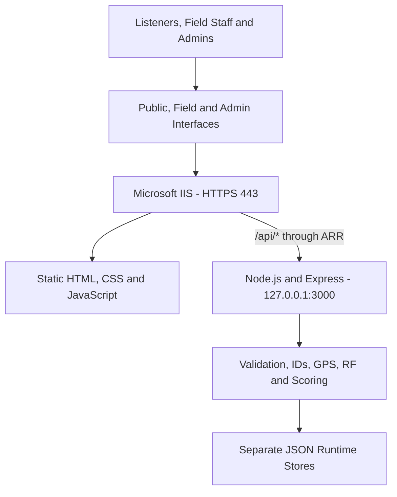

# 📡 MBI Broadcast Signal Logger


A browser-based system for collecting, mapping and analysing broadcast-signal reports from radio listeners and field personnel.

> This repository is a portfolio representation of the project. Sensitive configuration, internal information, production data, credentials, and company-specific deployment details have been excluded.

## 🎯 Project overview

Developed during my IT internship at Murphy Ben International (MBI) as an internship/internal experimental project for collecting and analyzing broadcast signal reports. I was responsible for the design and implementation of the application, working under the guidance of a senior member of the IT team.

The project solves a simple operational problem: broadcast teams need useful reception data from different locations without sending field personnel to every location first.

It provides:

- quick, one-handed signal reporting for radio listeners and fans;
- detailed GPS-assisted reports for field personnel;
- a central Admin interface for review, mapping and analysis;
- structured data that can be filtered and exported.

## 📱 Applications

| Application | Route | Purpose | Guide |
|---|---|---|---|
| Public Logger | `/` | Quick reports from listeners and fans | [Public Logger](docs/applications/PUBLIC_LOGGER.md) |
| Field Logger | `/field/` | Detailed field observations with GPS and RF context | [Field Logger](docs/applications/FIELD_LOGGER.md) |
| Admin Control Center | `/admin/` | Incident management, configuration, maps and exports | [Admin Center](docs/applications/ADMIN_CONTROL_CENTER.md) |

The Public application is served at the root route (`/`), not at a separate `/public/` route.

## 🔧 Core capabilities

| Area | Capabilities |
|---|---|
| Reporting | Public and Field workflows, GPS capture, observations and custom fields |
| Analysis | Signal scoring, Reception Experience Index, distance and RF references |
| Operations | Incident history, status, assignment, search and audit records |
| Mapping | Field map, combined Admin map and Google Maps handoff |
| Export | CSV, printable reports and Google Earth KML |
| Reliability | Server-generated IDs, separate data streams and duplicate protection |
| Administration | Stations, channels, forms, components, menus and permissions |
| Hosting | IIS, HTTPS, URL Rewrite and ARR reverse proxy |

## 🏗️ Architecture



IIS is the public-facing layer. Node.js remains bound to the local interface and processes API requests behind IIS.

[Read the architecture guide](docs/technical/ARCHITECTURE.md)

## 🚀 Run locally

Requirements: Node.js 18 or newer and npm.

```bash
cp server/config.example.json server/config.json
cd server
npm ci
npm start
```

On PowerShell:

```powershell
Copy-Item server/config.example.json server/config.json
Set-Location server
npm ci
npm start
```

Open:

- Public: `http://localhost:3000/`
- Field: `http://localhost:3000/field/`
- Admin: `http://localhost:3000/admin/`
- Health: `http://localhost:3000/api/health`

## 📚 Documentation

| Category | Guides |
|---|---|
| Applications | [Public Logger](docs/applications/PUBLIC_LOGGER.md) · [Field Logger](docs/applications/FIELD_LOGGER.md) · [Admin Center](docs/applications/ADMIN_CONTROL_CENTER.md) |
| Technical | [Architecture](docs/technical/ARCHITECTURE.md) · [API](docs/technical/API.md) · [Data and Analysis](docs/technical/DATA_AND_ANALYSIS.md) |
| Deployment | [Deployment](docs/deployment/DEPLOYMENT.md) · [Operations](docs/deployment/OPERATIONS.md) |
| Reference | [Release History](docs/RELEASE_HISTORY.md) · [Security](SECURITY.md) |

[Open the documentation index](docs/README.md)

## 📁 Repository structure

```text
mbi-signal-logger/
├── index.html
├── field/
├── admin/
├── shared/
├── server/
├── deployment/
├── docs/
│   ├── applications/
│   ├── technical/
│   └── deployment/
├── SECURITY.md
└── README.md
```

Runtime configuration, reports, audit records and ID sequences are excluded from Git.

## ⚠️ Important limits

- RF outputs are analytical references, not guaranteed coverage predictions.
- The project does not model terrain, buildings, vegetation or measured propagation.
- A production deployment requires independent security review and proper authentication.
- Never commit real deployment URLs, credentials, production records or private station data.

## 👨🏽‍💻 Author

Portfolio project maintained by [@yo-fola](https://github.com/yo-fola).
