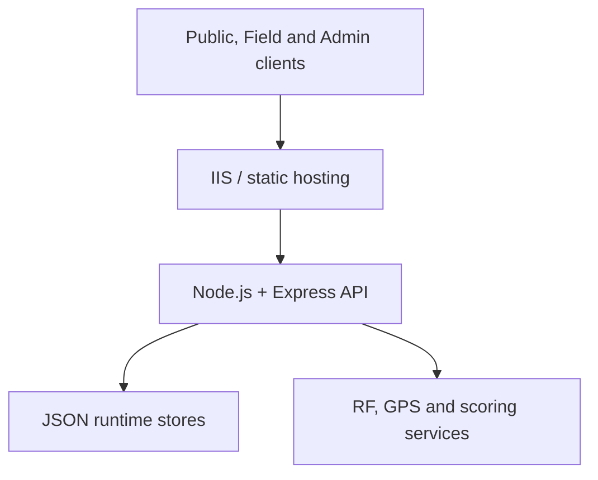

# MBI Signal Logger


> A portfolio-safe edition of a broadcast signal reporting and incident-management platform. All identities, hostnames, station data, coordinates and deployment examples in this repository are synthetic.

MBI Signal Logger brings public reports, field-engineer observations and administrative analysis into one workflow. It captures GPS context, stores incidents, calculates RF reference values, scores reception observations, presents live-map views and exports operational reports.

## Project at a glance

| Area | What it provides |
|---|---|
| Public Logger | A simple reporting experience for volunteers and general users |
| Field Logger | GPS-aware incident capture, technical readings, history and offline support |
| Admin Center | Configuration, incident management, maps, analytics, users and exports |
| Backend API | Validation, persistence, scoring, RF calculations, IDs and audit events |

## Architecture



The Node service can also serve the application directly for local development. In an IIS deployment, static assets are served by IIS and `/api/*` is reverse-proxied to the local Node process.

## Key features

- Separate Public, Field and Admin experiences
- Browser geolocation and GPS accuracy capture
- Server-generated incident IDs with duplicate-submission protection
- Separate Public and Field incident storage
- Configurable stations, channels, forms, choices and permissions
- Haversine distance and nominal EIRP calculations
- Horizon-limited terrestrial reception-radius reference
- Signal quality, stability and service-condition scoring
- Combined incident analysis and live-map views
- CSV and Google Earth KML reporting
- Runtime health checks and audit logging
- Responsive UI, dark mode and Field service-worker support

## Run locally

Requirements:

- Node.js 18 or newer
- npm

From the repository root:

```bash
cp server/config.example.json server/config.json
cd server
npm ci
npm start
```

On Windows PowerShell, use:

```powershell
Copy-Item server/config.example.json server/config.json
Set-Location server
npm ci
npm start
```

Open:

| Application | Local URL |
|---|---|
| Public Logger | `http://localhost:3000/` |
| Field Logger | `http://localhost:3000/field/` |
| Admin Center | `http://localhost:3000/admin/` |
| Health endpoint | `http://localhost:3000/api/health` |

The example configuration contains synthetic demonstration values only. Runtime JSON files are created locally and excluded by `.gitignore`.

## Project structure

```text
.
├── index.html                  Public / Volunteer Logger
├── field/                     Field Engineer application and service worker
├── admin/                     Administrative control center
├── shared/                    Shared styles and browser helpers
├── server/
│   ├── server.js              Express API and application services
│   ├── config.example.json    Synthetic configuration template
│   └── runtime-templates/     Empty runtime-store templates
├── deployment/                Generic IIS reverse-proxy example
└── docs/                      Technical and operational documentation
```

## Documentation

| Guide | Contents |
|---|---|
| [Project case study](docs/CASE_STUDY.md) | Problem, design choices, implementation and lessons learned |
| [API reference](docs/API.md) | Routes and server responsibilities |
| [Configuration](docs/CONFIGURATION.md) | Configuration ownership and RF inputs |
| [Data model](docs/DATA_MODEL.md) | Runtime stores, IDs and persistence behavior |
| [Deployment](docs/DEPLOYMENT.md) | Generic IIS/ARR and Node deployment flow |
| [Operations](docs/OPERATIONS.md) | Backups, upgrades, recovery and troubleshooting |
| [Release history](docs/RELEASE_HISTORY.md) | Main V6.5.x milestones |
| [Security](SECURITY.md) | Public-release boundaries and reporting guidance |

## RF model boundary

RF outputs are analytical references, not guaranteed coverage predictions. The implementation does not model terrain, buildings, vegetation, interference, antenna patterns, feeder loss, diffraction or calibrated propagation measurements.

## Public-release boundary

This repository intentionally excludes:

- private operational manuals and screenshots;
- production hostnames, IP addresses and IIS snapshots;
- real staff identities, email addresses and reporter information;
- live station coordinates and RF configuration;
- incident, audit and sequence data;
- credentials, certificates, tokens and private keys.

The private operational repository remains separate.

## Portfolio highlights

This project demonstrates:

- full-stack JavaScript development;
- REST API design and validation;
- defensive runtime-data handling;
- RF/GPS calculation integration;
- incident workflow and reporting design;
- IIS reverse-proxy deployment knowledge;
- documentation, release management and privacy-aware publishing.

ChatGPT was used as an assisted development and documentation tool. The implementation, review and release decisions remain human-directed.

## Limitations

- JSON persistence is intended for a controlled single-instance deployment.
- Authentication and authorization require production hardening before internet exposure.
- The RF model is a reference calculation, not a terrain-aware coverage-planning system.
- The included IIS file is an example and must be adapted before deployment.

## Author

Portfolio edition maintained by [@yo-fola](https://github.com/yo-fola).
