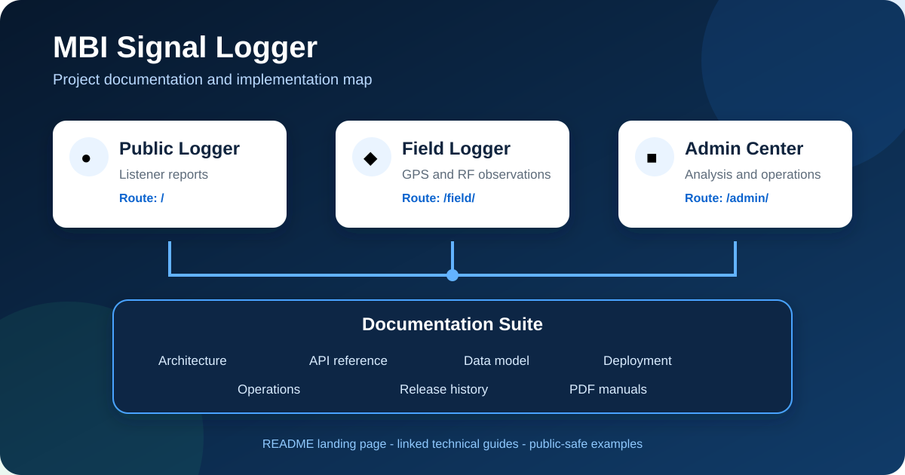
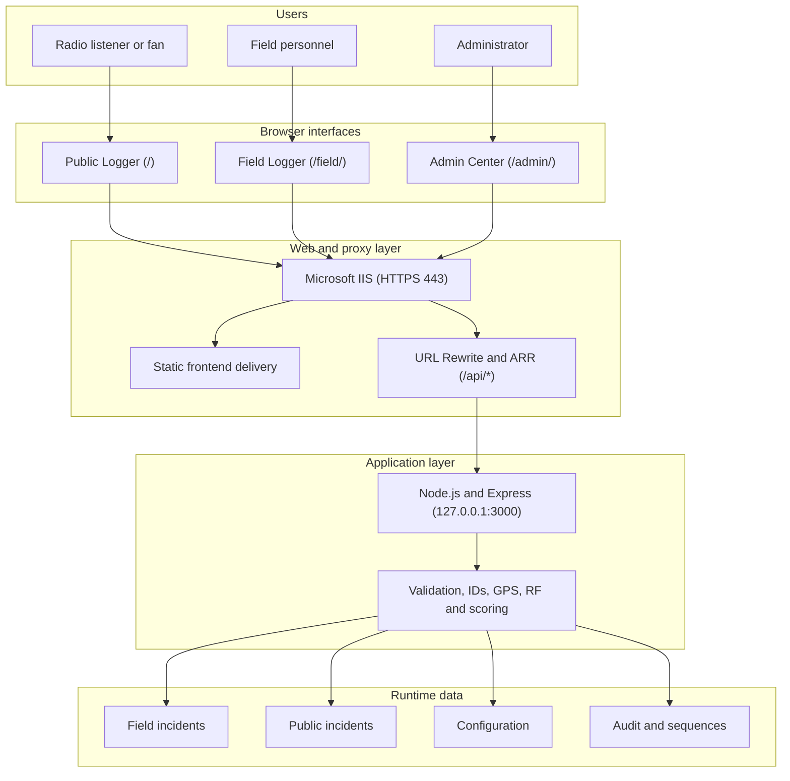

# 📡 MBI Broadcast Signal Logger


A multi-interface platform for collecting, mapping and analysing broadcast-signal reports from radio listeners and field personnel.

> This repository is a portfolio representation of the project. Sensitive configuration, internal information, production data, credentials, and company-specific deployment details have been excluded.



## 🧭 Documentation map

Use this README as the project landing page, then follow the guide that matches what you need.

| I want to... | Start here |
|---|---|
| Understand the problem and engineering decisions | [Project case study](docs/CASE_STUDY.md) |
| Operate the Public, Field and Admin applications | [Operational manual](docs/manuals/01_MBI_Signal_Logger_Operational_Manual.pdf) |
| Review features, architecture and implementation | [Feature and implementation reference](docs/manuals/02_MBI_Signal_Logger_Feature_and_Implementation_Reference.pdf) |
| Understand or integrate with the API | [API reference](docs/API.md) |
| Understand runtime files and incident identity | [Data model](docs/DATA_MODEL.md) |
| Configure stations, forms, scoring and UI ownership | [Configuration guide](docs/CONFIGURATION.md) |
| Deploy through IIS or plan an upgrade | [Deployment guide](docs/DEPLOYMENT.md) |
| Back up, troubleshoot or recover the system | [Operations guide](docs/OPERATIONS.md) |
| Review the project visually | [Visual guide](docs/manuals/04_MBI_Signal_Logger_Visual_Guide.pdf) |
| Review release milestones | [Release history](docs/RELEASE_HISTORY.md) |
| Review public security boundaries | [Security policy](SECURITY.md) |

## 🎯 Project overview

Developed during my IT internship at Murphy Ben International (MBI) as an internship/internal experimental project for collecting and analyzing broadcast signal reports. I was responsible for the design and implementation of the application, working under the guidance of a senior member of the IT team.

Broadcast teams need reliable information about how a radio signal is received across different locations. Sending personnel to every location can be slow and resource-intensive, while feedback received through calls or messages is difficult to compare and analyse.

The project helps teams:

- collect structured analytical data about radio-signal reception;
- receive useful reports directly from radio listeners and fans;
- reduce unnecessary initial field visits;
- capture GPS, time, station and reception conditions consistently;
- support quick, one-handed reporting on mobile devices;
- combine Public and Field observations for analysis and follow-up.

[Read the complete project case study →](docs/CASE_STUDY.md)

## ✨ Core features

- 📡 **Field Engineer Signal Logger**
- 👥 **Public / Volunteer Signal Reporting**
- 📍 **GPS-Based Incident Capture**
- 📶 **Server-Authoritative RF Signal Estimation**
- 🧮 **Signal Quality, Stability and Service Scoring**
- 📊 **Reception Experience Index**
- 🗼 **Station-Based RF Reference Calculations**
- 🛰️ **Distance-from-Station Enrichment**
- 🗺️ **Field Live Map**
- 🗺️ **Combined Admin Field/Public Live Map**
- 🚨 **Incident Management and History**
- 🌍 **Google Earth KML Export**
- 📄 **CSV / Excel-Compatible Reporting**
- 🖨️ **Printable Reports**
- 🆔 **Continuous Server-Generated Incident IDs**
- 🔁 **Duplicate Submission Protection**
- ⚙️ **Administrative Configuration**
- 🧩 **Component, Form and Menu Management**
- 🔐 **Roles and Permission Framework**
- 🧾 **Audit Logging**
- 🔒 **HTTPS / TLS through IIS**
- ↪️ **HTTP to HTTPS Redirection**
- 🛡️ **HSTS Support**

[Explore the feature and implementation reference →](docs/manuals/02_MBI_Signal_Logger_Feature_and_Implementation_Reference.pdf)

## 📱 Applications

| Application | Route | Designed for | Main responsibility |
|---|---|---|---|
| **Public / Volunteer Logger** | `/` | Radio listeners and fans | Submit a quick, location-aware reception report |
| **Field Engineer Logger** | `/field/` | Field personnel | Capture detailed GPS, reception and optional technical observations |
| **Admin Control Center** | `/admin/` | Administrators | Review incidents, manage configuration, analyse maps and export reports |

The current implementation serves the Public application at the root route (`/`), not at a separate `/public/` route.

[See the page-by-page operating guide →](docs/manuals/01_MBI_Signal_Logger_Operational_Manual.pdf)

## 🏗️ System architecture



IIS terminates HTTPS on port 443, serves the frontend files and proxies only `/api/*` to the loopback-bound Node.js service.

[Review architecture and implementation details →](docs/manuals/02_MBI_Signal_Logger_Feature_and_Implementation_Reference.pdf)

## 🔌 API surface

The REST API handles configuration, report validation, incident identity, analytical enrichment, persistence, summaries and exports. Key routes include:

```text
GET    /api/health
GET    /api/config
PUT    /api/config

GET    /api/audit
GET    /api/admin/audit
POST   /api/audit

POST   /api/rf-estimate

GET    /api/incidents
POST   /api/incidents
PATCH  /api/incidents/:id
DELETE /api/incidents/:id

GET    /api/public-incidents
GET    /api/analysis/incidents

GET    /api/summary
GET    /api/analysis/summary

GET    /api/incidents/export.csv
GET    /api/analysis/incidents/export.csv
```

[Open the complete API reference →](docs/API.md)

## 📶 RF and signal analysis

The backend enriches reports using configured broadcast-station reference data and GPS information.

- Haversine station-to-report distance;
- RF transmitter power and antenna-gain configuration;
- nominal EIRP calculation;
- broadcast-frequency and tower-height references;
- server-authoritative field-strength estimation;
- `dBµV/m` signal representation;
- Quality, Stability and Service scoring;
- Reception Experience Index;
- analytical Ideal Car Reception Radius.

### 📐 Ideal Car Reception Radius

Current model:

```text
terrestrial-horizon-limited-v2
```

The free-space sensitivity distance is retained only as an upper ceiling.

```text
radioHorizonKm =
  3.57 × sqrt(4/3) × (sqrt(towerHeightM) + sqrt(1.5))

idealRadiusKm =
  min(freeSpaceSensitivityDistanceKm, radioHorizonKm)
```

The calculation uses configured tower height, an assumed `1.5 m` car-antenna height, receiver sensitivity, broadcast frequency, nominal EIRP and a standard `4/3` effective-Earth-radius factor.

RF outputs are analytical references. They are not terrain-aware coverage predictions or substitutes for calibrated broadcast-engineering studies.

[Review the RF model and scoring implementation →](docs/manuals/02_MBI_Signal_Logger_Feature_and_Implementation_Reference.pdf)

## 🧮 Observation scoring

### ✅ Signal Quality

| Label | Color | Score |
|---|---|---:|
| Excellent | `#15803D` | 5 |
| Good | `#22C55E` | 4 |
| Fair | `#F59E0B` | 3 |
| Poor | `#EA580C` | 2 |
| No Signal | `#DC2626` | 0 |

### 📈 Signal Stability

| Label | Color | Score |
|---|---|---:|
| Stable | `#16A34A` | 4 |
| Fluctuating | `#F59E0B` | 3 |
| Intermittent | `#F97316` | 2 |
| Interference | `#9333EA` | 2 |
| Unstable | `#DC2626` | 1 |

### 📻 Service Condition

| Label | Color | Score |
|---|---|---:|
| Normal | `#16A34A` | 5 |
| Distortion | `#C026D3` | 3 |
| Audio Dropout | `#F97316` | 2 |
| Weak Reception | `#EA580C` | 2 |
| No Service / No Signal | `#DC2626` | 0 |

Historical records may contain legacy values. They remain readable instead of being destructively rewritten to match newer choice definitions.

## 📍 GPS and live mapping

The system supports:

- browser geolocation and GPS accuracy capture;
- incident and station coordinates;
- Haversine distance;
- Field Live Map;
- combined Field/Public Admin Live Map;
- source, station, status and date filtering;
- incident focus and current-device location;
- Google Maps handoff.

The Field map uses the most recent mapped incident when available instead of displaying a null location.

## 🌍 Reporting and Google Earth KML

Admin Export Reports supports CSV/Excel-compatible output, print output and Google Earth KML.

KML generation uses the same filtered record set as the Admin report view and supports:

- dynamic station folders;
- station placemarks followed by mapped Field/Public incidents;
- longitude/latitude coordinate order;
- omission of invalid GPS records;
- incident observations, distance values and normalized RF power;
- the corrected terrestrial car-reception radius.

For compatibility, KML intentionally avoids:

```text
TimeStamp
when
TimeSpan
gx:*
```

## 🆔 Incident identity and retry protection

New server-generated IDs use:

```text
PREFIX + REVERSED FULL DATE + HHMMSS + CONTINUOUS SEQUENCE
```

The streams remain separate:

- `INC` for Field / Engineer reports;
- `PUB` for Public / Volunteer reports.

Sequence state persists in `server/id_sequences.json`. Client submission keys and server-side duplicate checks reduce repeated incidents caused by network retries.

[Read the data-model reference →](docs/DATA_MODEL.md)

## 💾 Runtime data and persistence

The authoritative runtime files are:

```text
server/config.json
server/incidents.json
server/public_incidents.json
server/audit.json
server/id_sequences.json
```

These files are operational data and state. They must not be deleted or blindly overwritten during upgrades.

- [Read the data-model reference →](docs/DATA_MODEL.md)
- [Read the operations guide →](docs/OPERATIONS.md)

## ⚙️ Configuration ownership

Configuration is centralized under `server/config.json` and the Admin interface.

| Workspace | Responsibility |
|---|---|
| **Design** | Appearance only |
| **Menu Management** | Navigation only |
| **Component Management** | Sections, options and choice definitions |
| **Form Builder** | Visibility, required state, order, labels, help, defaults and custom fields |
| **Dashboard Layout** | Dashboard widgets |
| **Public Welcome and Content** | Public copy and workflow |
| **Stations and Channels** | Shared reference authorities |
| **GPS Configuration** | Technical GPS policy |

Public and Field choice definitions are managed independently through `choiceSets.public` and `choiceSets.field`.

[Read the configuration guide →](docs/CONFIGURATION.md)

## 🌐 Example routing

```text
https://signal-logger.example.com/          -> Public Logger
https://signal-logger.example.com/field/    -> Field Engineer Logger
https://signal-logger.example.com/admin/    -> Admin Control Center
https://signal-logger.example.com/api/*     -> IIS ARR
                                             -> 127.0.0.1:3000
                                             -> Node.js / Express API
```

The example hostname is not a live deployment address. Node.js remains bound to the local loopback interface.

## 🔒 IIS and HTTPS security

Microsoft IIS sits in front of Node.js and provides:

- static frontend hosting;
- ARR reverse proxying;
- URL Rewrite;
- HTTPS/TLS termination on port 443;
- HTTP-to-HTTPS redirection;
- HSTS after HTTPS is confirmed working.

Environment-specific IIS configuration and certificate material are not included. The generic `deployment/web.config.example` must be reviewed and adapted before use.

## 🚀 Deployment and upgrade

The deployment design uses Microsoft IIS for HTTPS, static content and reverse proxying, while Node.js remains private on `127.0.0.1:3000`.

```text
Back up runtime data
  -> deploy the smallest required change
  -> restart Node.js only for backend changes
  -> verify /api/health
  -> test Public and Field submissions
  -> confirm Admin data, maps and exports
```

Never blindly overwrite:

```text
server/config.json
server/incidents.json
server/public_incidents.json
server/audit.json
server/id_sequences.json
web.config
```

- [Read the IIS deployment guide →](docs/DEPLOYMENT.md)
- [Read the maintenance and recovery handbook →](docs/manuals/03_MBI_Signal_Logger_Maintenance_and_Recovery_Handbook.pdf)
- [Read the operational backup and troubleshooting guide →](docs/OPERATIONS.md)

## 🩺 Health check and troubleshooting

Primary backend check:

```text
GET /api/health
```

For frontend cache issues:

```text
Ctrl + Shift + R
Ctrl + F5
```

If the Field interface remains stale, clear the site's browser data and only then consider unregistering its service worker.

[Open the complete troubleshooting and recovery guide →](docs/OPERATIONS.md)

## 📚 PDF manual suite

| Manual | Coverage |
|---|---|
| [01 - Operational Manual](docs/manuals/01_MBI_Signal_Logger_Operational_Manual.pdf) | Public, Field and Admin workflows |
| [02 - Feature and Implementation Reference](docs/manuals/02_MBI_Signal_Logger_Feature_and_Implementation_Reference.pdf) | Architecture, features, API, data model, RF and configuration |
| [03 - Maintenance and Recovery Handbook](docs/manuals/03_MBI_Signal_Logger_Maintenance_and_Recovery_Handbook.pdf) | IIS deployment, upgrades, validation, troubleshooting and recovery |
| [04 - Visual Guide](docs/manuals/04_MBI_Signal_Logger_Visual_Guide.pdf) | Application, system, page and information-flow maps |

The PDFs contain public-safe examples and complement the editable Markdown guides.

## 🖼️ Documentation showcase

```text
docs/
├── CASE_STUDY.md
├── API.md
├── CONFIGURATION.md
├── DATA_MODEL.md
├── DEPLOYMENT.md
├── OPERATIONS.md
├── RELEASE_HISTORY.md
├── assets/
│   └── documentation-showcase.svg
└── manuals/
    ├── 01_MBI_Signal_Logger_Operational_Manual.pdf
    ├── 02_MBI_Signal_Logger_Feature_and_Implementation_Reference.pdf
    ├── 03_MBI_Signal_Logger_Maintenance_and_Recovery_Handbook.pdf
    └── 04_MBI_Signal_Logger_Visual_Guide.pdf
```

## 📁 Project structure

```text
mbi-signal-logger/
├── index.html                 # Public Logger
├── field/                     # Field Logger and service worker
├── admin/                     # Admin Control Center
├── shared/                    # Shared CSS, JavaScript and fonts
├── server/                    # Express API and public-safe templates
├── deployment/                # Generic IIS configuration example
├── docs/                      # Markdown guides, manuals and showcase assets
├── SECURITY.md
└── README.md
```

Runtime configuration, reports, audit records and sequence state are excluded from Git.

## 🧰 Technology stack

**Frontend:** HTML5, CSS3 and vanilla JavaScript  
**Backend:** Node.js, Express.js and REST  
**Hosting:** Microsoft IIS, URL Rewrite and Application Request Routing  
**Security:** HTTPS, TLS and loopback-only backend binding  
**Location and mapping:** Geolocation API, GPS, Google Maps, KML and Google Earth  
**Persistence:** Server-side JSON storage  
**Platform:** Windows and Windows Server

## ⚠️ Engineering boundaries

This project demonstrates the implemented workflow and engineering decisions, but a real production deployment still requires an independent security review, appropriate authentication and authorization, controlled filesystem permissions, monitoring, backups and organization-approved configuration.

The repository excludes actual deployment URLs, credentials, production records, internal addresses, private station data and company-specific infrastructure.

## 👨🏽‍💻 Author

Portfolio project maintained by [@yo-fola](https://github.com/yo-fola).
