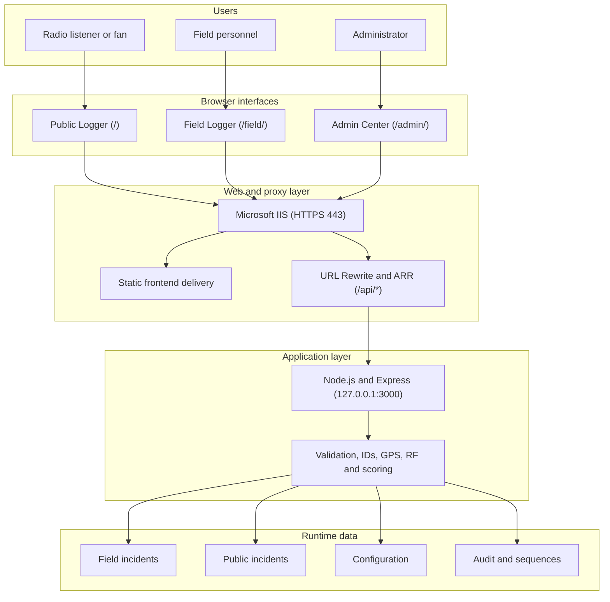

# 📡 MBI Broadcast Signal Logger


A multi-interface platform for collecting, mapping and analysing broadcast-signal reports from radio listeners and field personnel.

> This repository is a portfolio representation of the project. Sensitive configuration, internal information, production data, credentials, and company-specific deployment details have been excluded.


## 🧭 Documentation map

Use this README as the project landing page, then follow the guide that matches what you need.

| I want to... | Start here |
|---|---|
| Understand the problem and engineering decisions | [Project case study](docs/CASE_STUDY.md) |
| Operate the Public, Field and Admin applications | [Operational manual](docs/manuals/01_MBI_Signal_Logger_Operational_Manual.pdf) |
| Review features, architecture and implementation | [Feature and implementation reference](docs/manuals/02_MBI_Signal_Logger_Feature_and_Implementation_Reference.pdf) |
| Understand or integrate with the API | [API reference](docs/API.md) |
| Understand runtime files and incident identity | [Data model](docs/DATA_MODEL.md) |
| Configure stations, forms, scoring and UI ownership | [Configuration guide](docs/CONFIGURATION.md) |
| Deploy through IIS or plan an upgrade | [Deployment guide](docs/DEPLOYMENT.md) |
| Back up, troubleshoot or recover the system | [Operations guide](docs/OPERATIONS.md) |
| Review the project visually | [Visual guide](docs/manuals/04_MBI_Signal_Logger_Visual_Guide.pdf) |
| Review release milestones | [Release history](docs/RELEASE_HISTORY.md) |
| Review public security boundaries | [Security policy](SECURITY.md) |

## 🎯 Project overview

Developed during my IT internship at Murphy Ben International (MBI) as an internship/internal experimental project for collecting and analyzing broadcast signal reports. I was responsible for the design and implementation of the application, working under the guidance of a senior member of the IT team.

Broadcast teams need reliable information about how a radio signal is received across different locations. Sending personnel to every location can be slow and resource-intensive, while feedback received through calls or messages is difficult to compare and analyse.

The project helps teams:

- collect structured analytical data about radio-signal reception;
- receive useful reports directly from radio listeners and fans;
- reduce unnecessary initial field visits;
- capture GPS, time, station and reception conditions consistently;
- support quick, one-handed reporting on mobile devices;
- combine Public and Field observations for analysis and follow-up.

[Read the complete project case study →](docs/CASE_STUDY.md)

## ✨ Core features

| Category | Highlights |
|---|---|
| **Capture** | GPS-first reporting, accuracy information, stations, channels, observations and custom fields |
| **Identity** | Server-generated `PUB` and `INC` IDs with persistent, independent sequences |
| **Reliability** | Duplicate-submission protection, Field service worker and offline queue |
| **Analysis** | Haversine distance, observation scoring, nominal EIRP and RF references |
| **Operations** | Combined incident review, assignment, status, filtering, audit and health checks |
| **Mapping** | Field map, combined Admin map, current location and station/report comparison |
| **Reporting** | CSV, print and Google Earth KML exports from filtered report data |
| **Configuration** | Admin-managed stations, channels, forms, choice sets, UI behavior and permissions |

[Explore the feature and implementation reference →](docs/manuals/02_MBI_Signal_Logger_Feature_and_Implementation_Reference.pdf)

## 📱 Applications

| Application | Route | Designed for | Main responsibility |
|---|---|---|---|
| **Public / Volunteer Logger** | `/` | Radio listeners and fans | Submit a quick, location-aware reception report |
| **Field Engineer Logger** | `/field/` | Field personnel | Capture detailed GPS, reception and optional technical observations |
| **Admin Control Center** | `/admin/` | Administrators | Review incidents, manage configuration, analyse maps and export reports |

The current implementation serves the Public application at the root route (`/`), not at a separate `/public/` route.

[See the page-by-page operating guide →](docs/manuals/01_MBI_Signal_Logger_Operational_Manual.pdf)

## 🏗️ System architecture



IIS terminates HTTPS on port 443, serves the frontend files and proxies only `/api/*` to the loopback-bound Node.js service.

[Review architecture and implementation details →](docs/manuals/02_MBI_Signal_Logger_Feature_and_Implementation_Reference.pdf)

## 🔌 API surface

The REST API handles configuration, report validation, incident identity, analytical enrichment, persistence, summaries and exports.

| Area | Representative routes |
|---|---|
| Health and configuration | `GET /api/health`, `GET/PUT /api/config` |
| Incidents | `GET/POST /api/incidents`, `PATCH/DELETE /api/incidents/:id` |
| Public and combined analysis | `GET /api/public-incidents`, `GET /api/analysis/incidents` |
| RF analysis | `POST /api/rf-estimate` |
| Reporting | `GET /api/analysis/summary`, `GET /api/analysis/incidents/export.csv` |

[Open the complete API reference →](docs/API.md)

## 📶 RF, scoring and mapping

The backend enriches reports with station and GPS context, including:

- Haversine station-to-report distance;
- normalized transmitter power and nominal EIRP;
- reference field-strength estimates;
- quality, stability and service-condition scoring;
- a Reception Experience Index;
- a terrestrial horizon-limited reception-radius reference.

RF outputs are analytical references. They are not terrain-aware coverage predictions or substitutes for calibrated broadcast-engineering studies.

[Review the RF model and scoring implementation →](docs/manuals/02_MBI_Signal_Logger_Feature_and_Implementation_Reference.pdf)

## 🚀 Deployment and upgrade

The deployment design uses Microsoft IIS for HTTPS, static content and reverse proxying, while Node.js remains private on `127.0.0.1:3000`.

```text
Back up runtime data
  -> deploy the smallest required change
  -> restart Node.js only for backend changes
  -> verify /api/health
  -> test Public and Field submissions
  -> confirm Admin data, maps and exports
```

Never blindly overwrite:

```text
server/config.json
server/incidents.json
server/public_incidents.json
server/audit.json
server/id_sequences.json
web.config
```

- [Read the IIS deployment guide →](docs/DEPLOYMENT.md)
- [Read the maintenance and recovery handbook →](docs/manuals/03_MBI_Signal_Logger_Maintenance_and_Recovery_Handbook.pdf)
- [Read the operational backup and troubleshooting guide →](docs/OPERATIONS.md)

## 📚 PDF manual suite

| Manual | Coverage |
|---|---|
| [01 - Operational Manual](docs/manuals/01_MBI_Signal_Logger_Operational_Manual.pdf) | Public, Field and Admin workflows |
| [02 - Feature and Implementation Reference](docs/manuals/02_MBI_Signal_Logger_Feature_and_Implementation_Reference.pdf) | Architecture, features, API, data model, RF and configuration |
| [03 - Maintenance and Recovery Handbook](docs/manuals/03_MBI_Signal_Logger_Maintenance_and_Recovery_Handbook.pdf) | IIS deployment, upgrades, validation, troubleshooting and recovery |
| [04 - Visual Guide](docs/manuals/04_MBI_Signal_Logger_Visual_Guide.pdf) | Application, system, page and information-flow maps |

The PDFs contain public-safe examples and complement the editable Markdown guides.

## 🖼️ Documentation showcase

```text
docs/
├── CASE_STUDY.md
├── API.md
├── CONFIGURATION.md
├── DATA_MODEL.md
├── DEPLOYMENT.md
├── OPERATIONS.md
├── RELEASE_HISTORY.md
├── assets/
│   └── documentation-showcase.svg
└── manuals/
    ├── 01_MBI_Signal_Logger_Operational_Manual.pdf
    ├── 02_MBI_Signal_Logger_Feature_and_Implementation_Reference.pdf
    ├── 03_MBI_Signal_Logger_Maintenance_and_Recovery_Handbook.pdf
    └── 04_MBI_Signal_Logger_Visual_Guide.pdf
```

## 📁 Project structure

```text
mbi-signal-logger/
├── index.html                 # Public Logger
├── field/                     # Field Logger and service worker
├── admin/                     # Admin Control Center
├── shared/                    # Shared CSS, JavaScript and fonts
├── server/                    # Express API and public-safe templates
├── deployment/                # Generic IIS configuration example
├── docs/                      # Markdown guides, manuals and showcase assets
├── SECURITY.md
└── README.md
```

Runtime configuration, reports, audit records and sequence state are excluded from Git.

## 🧰 Technology stack

**Frontend:** HTML5, CSS3 and vanilla JavaScript  
**Backend:** Node.js, Express.js and REST  
**Hosting:** Microsoft IIS, URL Rewrite and Application Request Routing  
**Security:** HTTPS, TLS and loopback-only backend binding  
**Location and mapping:** Geolocation API, GPS, Google Maps, KML and Google Earth  
**Persistence:** Server-side JSON storage  
**Platform:** Windows and Windows Server

## ⚠️ Engineering boundaries

This project demonstrates the implemented workflow and engineering decisions, but a real production deployment still requires an independent security review, appropriate authentication and authorization, controlled filesystem permissions, monitoring, backups and organization-approved configuration.

The repository excludes actual deployment URLs, credentials, production records, internal addresses, private station data and company-specific infrastructure.

## 👨🏽‍💻 Author

Portfolio project maintained by [@yo-fola](https://github.com/yo-fola).
