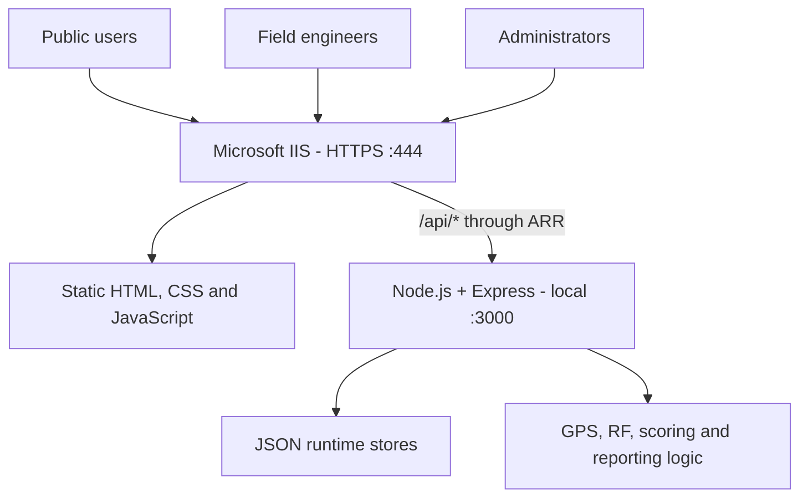

# MBI Broadcast Signal Logger


> A sanitized portfolio edition of the signal-logging platform I designed and developed for broadcast field operations. Real identities, station coordinates, incident data, credentials and private infrastructure details are not included.

## Live project

**Field Signal Logger:** [https://feeds.aforevo.com:444/field/](https://feeds.aforevo.com:444/field/)

The live deployment shows the working Field Engineer interface. The public repository uses synthetic configuration and does not expose the private operational data behind the deployed system.

## What the project is about

MBI Broadcast Signal Logger is a browser-based platform for recording, managing and analysing broadcast reception incidents.

It brings three workflows into one system:

| Application | Purpose |
|---|---|
| Public / Volunteer Logger | Makes it easy for members of the public to report reception problems |
| Field Engineer Logger | Captures GPS position, observations and optional technical readings during field work |
| Admin Control Center | Manages incidents, stations, channels, configuration, maps, reports, users and exports |

The backend validates reports, creates incident IDs, stores Public and Field records separately, calculates RF reference information and exposes the results through a REST API.

## Why I built it

Signal reports can arrive without accurate location, time, station or reception information. They may also be scattered between messages, spreadsheets and manual notes.

I built this project to create a consistent workflow where:

- every report follows the same structure;
- GPS and time are captured with the incident;
- Public and Field reports remain distinguishable;
- administrators can review both sources together;
- RF calculations provide useful engineering context;
- reports can be exported for spreadsheets and Google Earth;
- application upgrades do not overwrite operational records.

## How I built it

1. I separated the user experience into Public, Field and Admin interfaces.
2. I built the browser interfaces with HTML5, CSS3 and vanilla JavaScript.
3. I created a Node.js and Express REST API for validation, storage and calculations.
4. I used separate JSON stores for Field incidents, Public incidents, configuration, audit records and ID sequences.
5. I added GPS capture, Haversine distance, nominal EIRP and RF reference calculations.
6. I added observation scoring for signal quality, stability and service condition.
7. I implemented server-generated incident IDs and duplicate-submission protection.
8. I added Admin maps, filtering, CSV reporting, print output and KML export.
9. I hosted the frontend on Microsoft IIS and used URL Rewrite with ARR to proxy `/api/*` to Node.
10. I configured HTTPS and tested the complete browser-to-IIS-to-API request path.

Because another service already used the standard HTTPS port in the deployment environment, the IIS site was exposed through HTTPS port `444`. Node remained bound locally on port `3000`, behind IIS.

## System architecture



### Request flow

```text
Browser
  -> HTTPS request to IIS
  -> IIS serves the Public, Field, Admin and shared frontend files
  -> /api/* requests are matched by URL Rewrite
  -> ARR forwards the request to the local Node.js service
  -> Express validates and processes the request
  -> JSON runtime stores are read or updated
  -> The API response returns through IIS to the browser
```

## Main features

- GPS-first incident capture with accuracy reporting
- Separate Public and Field reporting workflows
- Server-generated `INC` and `PUB` incident IDs
- Duplicate-submission protection
- Configurable stations, channels, forms and observation choices
- Signal quality, stability and service-condition scoring
- Haversine distance calculation
- RF power normalization and nominal EIRP
- Terrestrial horizon-limited reception-radius reference
- Field and combined Admin live maps
- Incident filtering, status updates and history
- CSV, print and Google Earth KML reports
- Dark mode and responsive navigation
- Field service worker and offline queue
- Audit records and runtime health checks

## How to use it

### Public / Volunteer reporting

1. Open the Public Logger.
2. Allow location access when requested.
3. Select the relevant station and channel.
4. Choose the observed signal quality, stability and service condition.
5. Add a short observation if needed.
6. Submit the report.

The server validates the report, adds location and RF context, generates a `PUB` ID and stores it in the Public incident stream.

### Field Engineer reporting

1. Open the [Field Signal Logger](https://feeds.aforevo.com:444/field/).
2. Capture or confirm the current GPS position.
3. Select the station and channel being checked.
4. Record the reception observations.
5. Add optional measured technical readings.
6. Select the incident priority and assignment.
7. Submit the incident.

The server generates an `INC` ID, performs the reference calculations and saves the incident to the Field stream.

### Administration

The Admin Control Center supports:

- reviewing Public and Field incidents;
- changing incident status and assignment;
- managing stations, channels, users and permissions;
- configuring Public and Field forms;
- viewing combined incident maps;
- exporting CSV, printable and KML reports;
- checking audit activity and system health.

The public portfolio does not include a link to the private Admin deployment.

## Run the sanitized edition locally

Requirements:

- Node.js 18 or newer
- npm

From the repository root:

```bash
cp server/config.example.json server/config.json
cd server
npm ci
npm start
```

On Windows PowerShell:

```powershell
Copy-Item server/config.example.json server/config.json
Set-Location server
npm ci
npm start
```

Open:

| Application | Local URL |
|---|---|
| Public Logger | `http://localhost:3000/` |
| Field Logger | `http://localhost:3000/field/` |
| Admin Control Center | `http://localhost:3000/admin/` |
| API health check | `http://localhost:3000/api/health` |

## Repository file structure

```text
mbi-signal-logger/
├── index.html
├── field/
│   ├── index.html
│   ├── manifest.webmanifest
│   └── sw.js
├── admin/
│   └── index.html
├── shared/
│   ├── v65.css
│   └── v65.js
├── server/
│   ├── server.js
│   ├── package.json
│   ├── package-lock.json
│   ├── config.example.json
│   └── runtime-templates/
│       ├── incidents.example.json
│       ├── public_incidents.example.json
│       ├── audit.example.json
│       └── id_sequences.example.json
├── deployment/
│   ├── README.md
│   └── web.config.example
├── docs/
│   ├── CASE_STUDY.md
│   ├── API.md
│   ├── CONFIGURATION.md
│   ├── DATA_MODEL.md
│   ├── DEPLOYMENT.md
│   ├── OPERATIONS.md
│   └── RELEASE_HISTORY.md
├── SECURITY.md
└── README.md
```

Runtime files such as `config.json`, incident records, audit logs and sequence state are excluded from Git.

## IIS deployment structure

The following is the sanitized equivalent of the IIS file layout used for the project:

```text
C:\inetpub\wwwroot\signal-logger\
├── index.html
├── field\
│   ├── index.html
│   ├── manifest.webmanifest
│   └── sw.js
├── admin\
│   └── index.html
├── shared\
│   ├── v65.css
│   ├── v65.js
│   └── fonts\
├── server\
│   ├── server.js
│   ├── package.json
│   ├── package-lock.json
│   ├── config.json
│   ├── incidents.json
│   ├── public_incidents.json
│   ├── audit.json
│   └── id_sequences.json
└── web.config
```

### IIS file responsibilities

| File or directory | Role |
|---|---|
| `index.html` | Public / Volunteer Logger |
| `field/` | Field Engineer application, manifest and service worker |
| `admin/` | Admin Control Center |
| `shared/` | Shared interface styling, JavaScript helpers and fonts |
| `server/server.js` | Node.js API entry point |
| `server/config.json` | Active application configuration |
| `server/incidents.json` | Field incident store |
| `server/public_incidents.json` | Public incident store |
| `server/audit.json` | Administrative and API activity |
| `server/id_sequences.json` | Persistent `INC` and `PUB` counters |
| `web.config` | IIS default document, rewrite, reverse-proxy and HTTPS rules |

The repository includes a sanitized [`deployment/web.config.example`](deployment/web.config.example). The live IIS file, certificate material and environment-specific bindings remain private.

## IIS configuration process

The IIS deployment involved:

1. creating the site and selecting its physical path;
2. installing IIS URL Rewrite and Application Request Routing;
3. enabling ARR proxy support;
4. adding a rewrite rule for `/api/*`;
5. forwarding API requests to `http://localhost:3000/api/*`;
6. configuring the HTTPS site binding and certificate;
7. keeping the Node process bound to the local interface;
8. testing static files, API health, redirects and browser caching.

The generic IIS example in this repository is for study and must be adapted before deployment.

## Documentation

| Guide | Contents |
|---|---|
| [Project case study](docs/CASE_STUDY.md) | Problem, design decisions, implementation and lessons learned |
| [API reference](docs/API.md) | Routes and server responsibilities |
| [Configuration](docs/CONFIGURATION.md) | Configuration ownership and RF inputs |
| [Data model](docs/DATA_MODEL.md) | Runtime stores, IDs and persistence |
| [Deployment](docs/DEPLOYMENT.md) | IIS/ARR and Node deployment workflow |
| [Operations](docs/OPERATIONS.md) | Backup, upgrade, recovery and troubleshooting |
| [Release history](docs/RELEASE_HISTORY.md) | Main V6.5.x milestones |
| [Security](SECURITY.md) | Public-release boundaries and reporting guidance |

## Key technical decisions

### Server-authoritative calculations

Incident identities, RF reference values and derived scoring are produced by the server so every interface uses the same calculation path.

### Separate incident streams

Public and Field incidents are stored separately, while combined analysis endpoints give administrators one operational view.

### Safe upgrades

Runtime JSON is treated as operational data rather than deployment content. It is ignored by Git and must be backed up before application updates.

### Local Node binding

Node listens on the loopback interface. IIS is the public-facing layer responsible for HTTPS and reverse proxying.

## RF model limitation

RF outputs are analytical references, not guaranteed coverage predictions. The current implementation does not model terrain, buildings, vegetation, interference, feeder loss, diffraction or measured propagation calibration.

## Public-release boundary

This repository intentionally excludes:

- real staff and reporter identities;
- live incident, audit and sequence data;
- real station coordinates and private RF settings;
- certificate files, passwords, tokens and private keys;
- internal IP addresses and private server details;
- the private operational manuals and screenshots.

## Skills demonstrated

- HTML5, CSS3 and responsive JavaScript
- Node.js and Express REST API development
- GPS and mapping integration
- RF and Haversine calculations
- file-backed persistence and validation
- Microsoft IIS, URL Rewrite and ARR
- HTTPS deployment and troubleshooting
- operational documentation and privacy-aware publishing

## Author

Portfolio project maintained by [@yo-fola](https://github.com/yo-fola).
