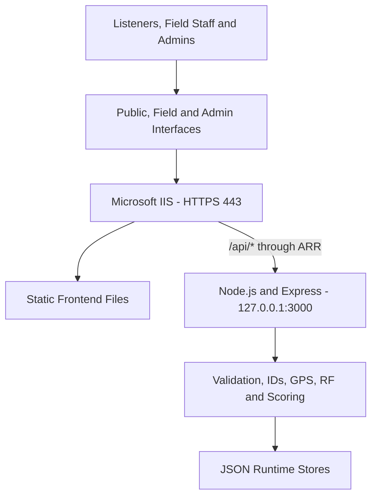

# 🏗️ Architecture

## System design

MBI Signal Logger uses a layered web architecture.

## Layer responsibilities

| Layer | Responsibility |
|---|---|
| Browser interfaces | Collect reports and display operational information |
| IIS | Terminates HTTPS, serves static files and redirects HTTP |
| URL Rewrite and ARR | Proxies `/api/*` requests to Node.js |
| Node.js and Express | Validates requests and runs application logic |
| JSON stores | Preserve reports, configuration, audit records and ID sequences |

## Request flow

1. A user opens the Public, Field or Admin route.
2. IIS serves the required HTML, CSS and JavaScript.
3. The browser sends API requests through `/api/*`.
4. IIS ARR forwards those requests to `127.0.0.1:3000`.
5. Express validates and processes the request.
6. The backend reads or updates the correct runtime file.
7. The response returns through IIS to the browser.

## Route mapping

| Request | Target |
|---|---|
| `/` | Public Logger |
| `/field/` | Field Logger |
| `/admin/` | Admin Control Center |
| `/shared/*` | Shared CSS, JavaScript and fonts |
| `/api/*` | Express API through ARR |

## Main design decisions

- IIS is the only public-facing application layer.
- Node.js listens on the loopback interface.
- Public and Field incidents use separate stores.
- Identity, scoring and RF enrichment are calculated by the server.
- Runtime data is separated from files replaced during upgrades.

## Related guides

- [API](API.md)
- [Data and Analysis](DATA_AND_ANALYSIS.md)
- [Deployment](../deployment/DEPLOYMENT.md)
